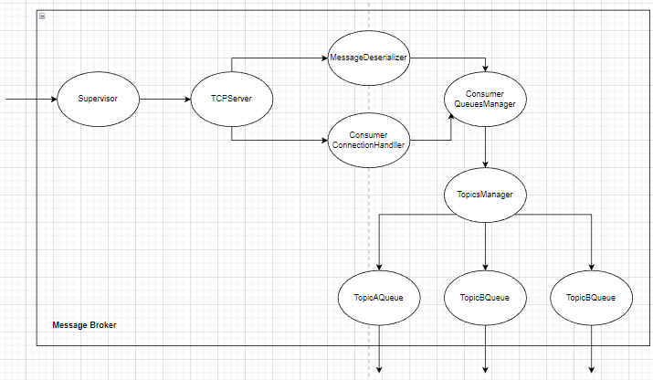

# Lab 1: Stream Processing with Actors

## [Resources](./docs/links.md)

# System diagrams

The built system is composed of 3 main components: Producer, Consumers and MessageBroker.

The Producer component is responsible for sending the received tweets (stream of SSE) from the input docker image to the MessageBroker. The sent tweets should be represented in a simplified form:

```
trait Message {
    TweetId: String;
    Topic: String;
}
```

The MessageBroker component is responsible for enqueueing the message into the corresponding queue, based on the topic, and to provide the possibility for the Consumer to subscribe to a specific queue.


<p align="center">Figure 1. System Components</p>

MessageBroker's functionality can be divided into several small steps and for each step we can define a responsible actor.

_MessageBroker_ - instantiates all the actors responsible for the message broker logic

_TCPClient_ - reads the incoming messages from the Producer

_MessageDeserializer_ - deserialize the incoming `ByteString`

_MessagePersistor_ - stores the incoming messages to be able to restore in case of transmission failure

_TopicsManager_ - adds the message to a specific queue based on the message's topic.

_TopicQueue_ - stores the received messages and sends them to the subscribed consumers.


<p align="center">Figure 2. Message Broker Supervision Tree</p>



<p align="center">Figure 3. Message Broker Message Flow</p>
